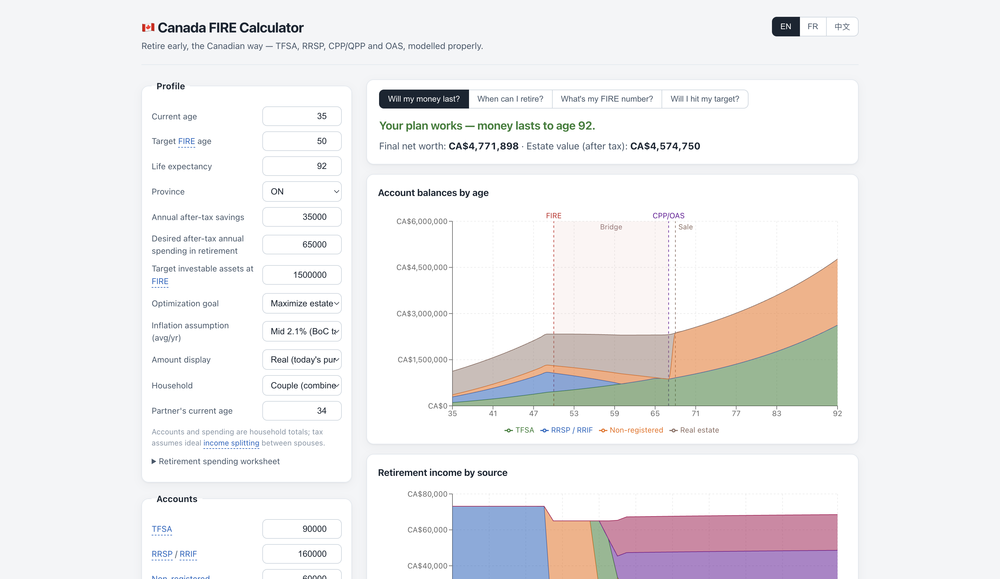
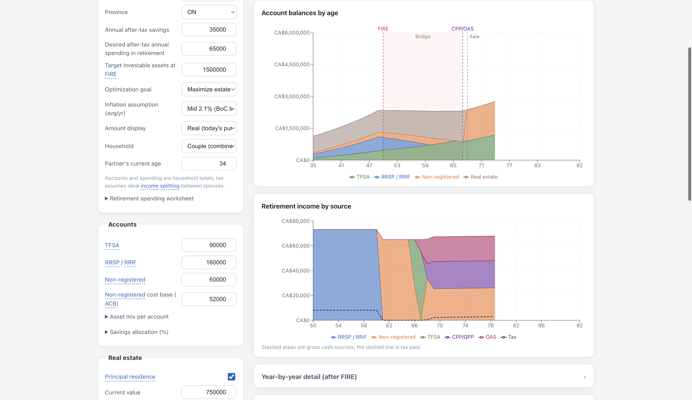
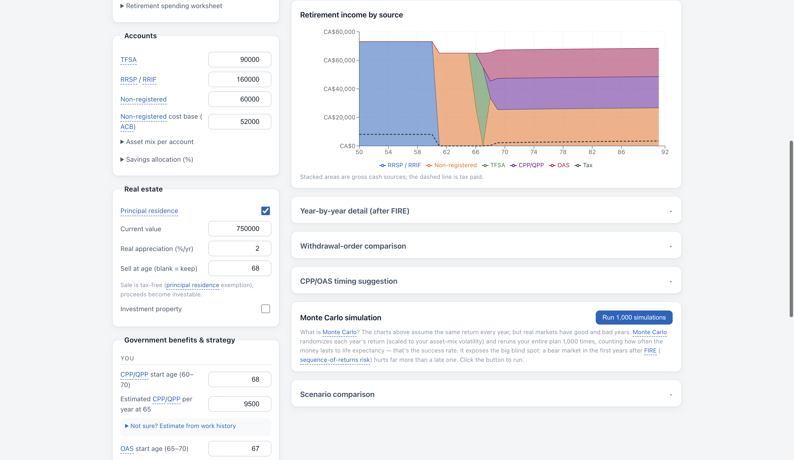
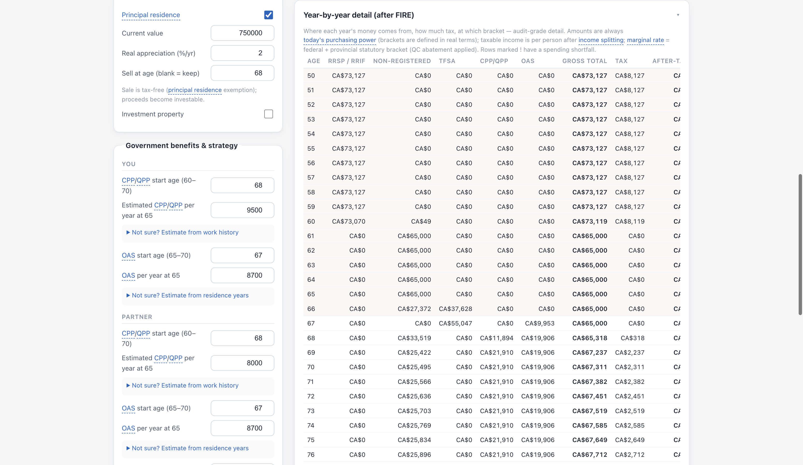
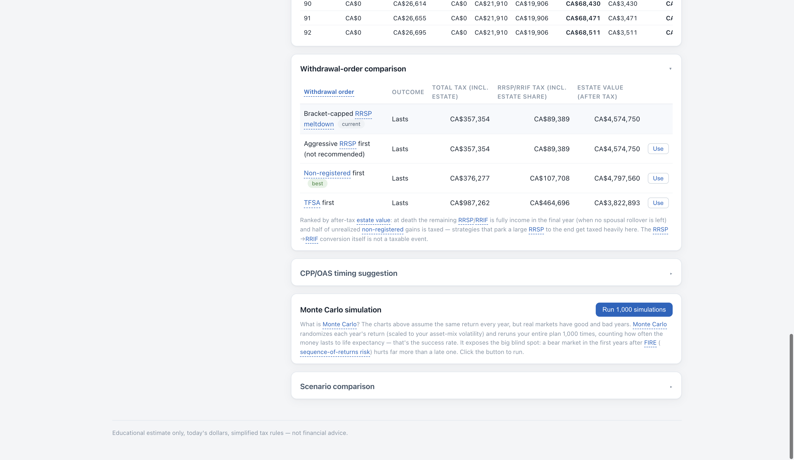
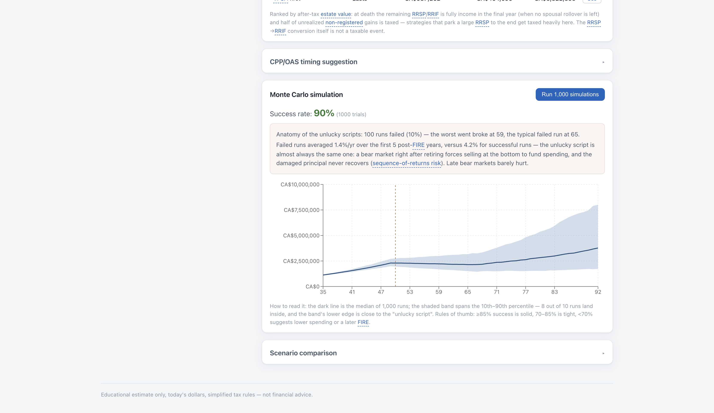
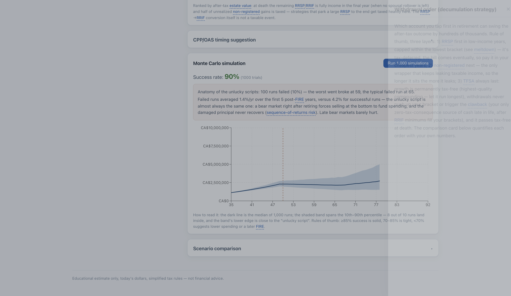

# 🇨🇦 加拿大 FIRE 计算器

[English](README.md) · [Français](README_FR.md) · **中文**

一个**专为加拿大人打造**的 FIRE（财务独立，提前退休）计算器。通用的"4% 法则"工具
忽略了真正决定加拿大人能否提前退休的所有因素：账户税务属性（TFSA / RRSP / 非注册）、
CPP/QPP 与 OAS 的开领时机、RRIF 强制最低取款、OAS 回收税（clawback）、取钱顺序策略、
以及身后 RRSP 的清算方式。这个计算器把它们全部建模。

**在线使用：<https://leoli-dev.github.io/canada-fire-calculator/>**

**隐私优先的纯前端应用**：无后端、无账号、无 AI。你的数字永远不离开浏览器
（保存在 localStorage；浏览器禁用站点存储时照样能用，只会提示计划不会被保存）。
匿名使用统计（页面访问、功能点击，绝不包含你的输入）**需要你同意才开启**：
同意之前不加载 Google Analytics，浏览器发出 Global Privacy Control 或 Do Not Track
信号视为拒绝，页脚随时可以改主意。支持英语 / 法语 / 中文。

**两种填写方式。** *引导模式*把问题拆成一页一页的短问题，分八类（家庭、储蓄、
资产、住房、支出、收入、偏好，以及可选的税务细节），目录可自由跳转，最后先看
核对页再生成结果。*专业模式*是完整表单、结果实时更新。两种模式编辑的是同一份
计划，随时可以切换；两边都有一个需要确认的“重置全部数据”。



## 快速开始

```sh
npm install
npm run dev      # 本地开发服务器
npm test         # 单元测试（vitest）
npm run test:e2e # 端到端测试（Playwright，桌面与 320px 手机宽度）
npm run build    # 类型检查 + 生产构建
```

计算引擎（`src/engine/`）是零 UI 依赖的纯 TypeScript 模块，界面上每一个数字都
来自确定性的、有单元测试覆盖的逐年模拟。税务和福利参数放在 `src/engine/rules/`
下带日期、带版本的规则包里，每个字段都对应到它所引用的官方来源（见
[docs/rule-coverage.md](docs/rule-coverage.md)；OAS/GIS 每季度更新流程见
[docs/quarterly-benefit-refresh.md](docs/quarterly-benefit-refresh.md)）。

## 它在算什么

**三阶段逐年模拟**，全程实际（扣通胀）金额：

1. **积累期**（现在 → FIRE）：税后储蓄按你的比例流入 TFSA / RRSP / 非注册账户。
2. **桥接期**（FIRE → CPP/OAS）：低收入窗口。支出由账户提款按策略供给；引擎每年
   用二分法反解"取多少税前的钱才能到手目标税后支出"。
3. **领取期**（CPP/OAS → 预期寿命）：政府福利到账；72 岁起 RRIF 强制最低取款，
   不管你需不需要——夫妻家庭按较年轻一方的年龄计算最低提款（spousal age election），
   因为这永远是更优选择，本计算器自动应用。

**税务引擎**：真实的联邦 + 省级边际税率表（全部 13 个省和地区，2026 数值，
数据驱动、每年更新）、基本免税额（含联邦、曼尼托巴和育空的高收入递减）、魁省
联邦税减免、安省 surtax 与健康保费、魁省 RAMQ 药保费与 FSS 供款、年龄额度
（65 岁起）与养老金收入抵免——雇主养老金年金任何年龄合格、RRIF 取款 65 岁起
（含萨省 senior supplement）、按 ACB 追踪的资本利得 50% 计入、非注册账户分配的年度税
拖累、按人计算的 OAS 回收税（含 75 岁后档位）、低应税收入退休者的 GIS（按 ESDC
最新一季的表格、分家庭类型定价：单身、夫妻都领 OAS、配偶领 Allowance、配偶两者
都不领；工作收入豁免按每个有收入的人分别计算；60–64 岁配偶领 Allowance 津贴）、
身后遗嘱认证费，以及夫妻模式下的收入分割计税（养老金分割也会反映到 OAS 回收税
和按年龄才有的养老金抵免上）。魁省另加独居额度，以及配偶用不完的基本个人抵免
转移（TP-1 第 431 行）。FIRE 后的副业收入按 2026 年标准扣工资税：CPP/QPP、
CPP2/QPP2、EI，魁省再加 QPIP；自雇收入两份 CPP 都要交。应用里有一张分省覆盖
矩阵，列出每个税额包含哪些抵免、每个数字出自哪份官方文件、哪些没有建模。

**取钱顺序策略**，用你自己的数字并排对比：

- **压税 meltdown**（默认）：RRSP 优先出钱，但只取支出所需、且绝不超过扣除
  CPP/OAS 后所选天花板的剩余额度（夫妻各一份）——默认最低税阶，RRSP 余额大的
  用户也可选第二税阶或 OAS clawback 门槛，避免钱一直困在最低税阶、最后被迫
  RRIF 强制取款和身后 100% 计税；剩余部分留过 71 岁由 RRIF 最低取款自然
  流出——不为提前交税而多取一分钱。
- 激进 RRSP 优先、先取非注册、先取 TFSA——让你看清每种选择的代价。

**遗产端的诚实计算**：身后剩余 RRSP/RRIF 全额计入最后一年收入、未实现利得一半
计税（TFSA 和主要住宅免税传承）；非注册账户和未售房产还要付遗嘱认证费/遗产
管理税（13 个省和地区各按本地公布的收费法规或条例定价；有指定受益人的注册账户
完全绕开）。资本利得按名义 ACB 账本计算；去世当年按最终申报表的增量收入计税，
保留身后的资本损失。因此策略按
**税后遗产价值**排名——或者选择 **Die with Zero（花光离场）**目标，按
"最大可持续年支出"排名。

**同时建模**：每位配偶可选的**雇主 DB 养老金**（选定起领年龄的终身年金、可部分
CPI 指数化、付到 65 岁止的过桥金——按养老金收入计税、任何年龄可分割、计入 OAS
clawback 与 GIS；独立的**锁定 DC/LIRA** 账户会在计划规定提款年龄前把受限养老金排除在桥接资金之外）、**FHSA** 夫妻合并单桶（供款
从年储蓄中划出、增长跟随 RRSP 假设，终点必然免税坍缩——买房年流向首付，否则
在开户满 15 年或 71 岁（取早）时并入 RRSP）、主要住宅出售（免税，如约定年龄卖房
降级）**或计划中的未来购房**（首付资金按 FHSA→TFSA→非注册→RRSP 固定顺序流出；
首套房从 RRSP 取的部分走**购房计划 HBP**，每位买家最多 $60,000 免税取出，购房
后第二年起每年还 1/15，储蓄不够还的那部分当作收入计税；剩余部分由自动带出的
房贷分期摊还）、任意多套投资房——每套
可选出售年龄（利得计税）或持有收**净租金**（按普通收入计税，参与 OAS 回收税和
GIS 收入测试）——还可以给某套房单独挂一笔**关联房贷**（卖房时从卖房款里优先
清偿，持有期间利息部分可抵扣该房租金收入）、**负债**（房贷 / 车贷 / 其他：引擎由余额 / 年供款 / 剩余年数
反推每笔贷款的隐含利率，名义固定供款被通胀逐年侵蚀——退休期供款计入支出目标
直到还清，余额从净资产和遗产中扣除）、**Barista FIRE 额外收入**（FIRE 后一段
年龄区间，可选雇佣、自雇或其他收入，按类型扣工资税，享受官方 GIS 工作收入豁免）、有孩家庭的**加拿大牛奶金（CCB）**（免税、
像 GIS 一样按收入递减，但收入口径含 OAS；只从 FIRE 年龄起计算，FIRE 前的牛奶金
视为已含在年储蓄里）、按工作经历估算 CPP/QPP（最好 39 年规则
+ 提前开领的分母修正——提前退休会稀释平均值，但 60 岁开领的稀释比想象的轻）、
按居住年数估算 OAS 及其 75 岁 +10%、CPP 60–70（QPP 到 72）/ OAS 65–70 逐岁时机
表格、投资费用（MER）、以及蒙特卡洛模拟（Web Worker 里跑 1000 次随机收益，
全账户共用每年市场剧本）附失败解剖。输入实时校验——年龄顺序错误、负数金额、
超出开领窗口、永远还不完的贷款都会行内标红。

## 如何填写

专业模式从左栏往下填；引导模式把同样的字段一页一页问你，每页都有自己的说明。
页面上所有带虚线下划线的词都能点开通俗解释（见下方术语抽屉）。

- **基本信息**——年龄、省份、每年税后储蓄、退休后期望的税后年支出（今日购买力；
  可用支出细算表按类目搭出来）。选择**优化目标**：遗产最大化，或 **Die with
  Zero**（最大化稳定支出、刚好花光）。通胀假设和"实际/名义"切换只影响金额的
  *显示*——计算始终以实际值进行。
- **计算单位**——家庭模式下账户与支出按家庭合计，收入平分到两人分别计税
  （两份免税额、两份低税阶）；配偶有自己的 CPP/OAS 时间线。
- **账户**——各账户当前余额。夫妻填两人合计，之后再说明每个账户在谁名下（或各自
  持有多少）；确认之前，依赖“谁持有什么”的结果会显示为带标注的估算。非注册账户
  请填 **ACB**（券商界面叫 book cost，含再投资的分配和后来的买入）：只有超出成本
  的利得才交税，猜一个比例撑不起精确的资本利得税。核实之前可以先留空；成本高于
  当前市值就是亏损，结果引用它之前需要先确认能否抵扣。资产配置预设会按账户设定
  合理的实际收益率和波动率。
- **FHSA**——夫妻合并单桶（这里填两人合计，不是每人分别填）：当前余额、每年
  供款（从年储蓄中先划出，再按比例分配到 TFSA/RRSP/非注册）、已开户年数
  （供款额度从开户当年才开始累积，这点和 TFSA 不同）。账户止于最早者：合格
  购房、开户满 15 年、或年满 71 岁。
- **房产**——一张主要住宅卡片，二选一：**已持有**（当前价值、增值率、可选
  出售年龄）或**计划购买**（购买年龄、今日购买力计的房价与首付、由供款+年限
  自动带出的房贷、每年持有成本净变化），外加任意多套投资房，每套可选出售
  年龄和可选净年租金（租金减运营成本；卖出当年停止）。主要住宅出售免税，
  当年即变为可投资资金；计划购买的首付按 FHSA→TFSA→非注册→RRSP 固定顺序
  流出，顺序不可配置。RRSP 部分默认走 HBP，可以针对这次购房关掉。
- **负债**——房贷、车贷或其他，每笔填（余额、年供款、剩余年数）。"每年税后
  储蓄"请填还贷*之后*实际存下的钱；引擎会把供款计入退休支出，直到每笔贷款
  还清。
- **额外收入**——可选的 FIRE 后收入（Barista FIRE），设一段年龄区间和收入类型
  （默认雇佣，也可选自雇，或不扣工资税的其他收入）；不要自己从退休支出里扣掉它。
- **孩子**——可选，每个孩子填一行当前年龄；从 FIRE 年龄起启用牛奶金（CCB）。
  FIRE 前已经在领的牛奶金视为已含在年储蓄里，不会重复计算。
- **政府福利**——每人的 CPP/QPP、OAS 开领年龄和 65 岁金额。不确定填多少？
  用内置估算器（CPP 按工作经历、OAS 按居住年数），或到 My Service Canada
  Account 查精确数字。每个金额都记得自己的来源：估算值在你改 FIRE 年龄时会重新
  计算；来自官方 statement 的数字永远不会被改写，只会提示你复核。
- **雇主养老金**——可选、每位配偶一份：填 pension statement 上的终身年领取额
  （提前开领已折减）、起领年龄、CPI 指数化比例、过桥金（付到 65 岁）。有 DC
  计划或 LIRA？请使用独立的锁定 DC/LIRA 账户；在填入的最早提款年龄前不能用于支出。
- **税务细节**（可选）——精确的逐人计税需要的事实：每人的工作收入、账户类型
  （RRSP、RRIF、LIF）及持有人、每人 CRA statement 上的 TFSA、RRSP、FHSA 额度、
  spousal RRSP 供款历史，魁省还有药保状态和是否独居。面板为每个账户逐人维护一本
  额度账，超出已记录额度的计划供款会显示出来；未知额度既不当作无限，也不当作零。
  跳过也能出结果，只是需要这些事实的部分会标为估算。

## 如何看懂结果

**顶部四个提问 tab**，每个答案下都附判定方法说明：*钱够撑到底吗？* · *我几岁能
退休（最早可行年龄）？* · *我的 FIRE 数字（退休那一刻需要多少 vs 届时预计有
多少）？* · *目标能达标吗（几岁达标）？* 手机上四个 tab 排成 2 × 2，表单上方
还有一行结论，点一下直接跳到完整结果。

计划撑不到底时会直接说清楚：几岁花光、第一笔缺口在哪年、原因，以及可以改什么。
如果计划缺少精确回答所需的事实（账户归属未确认、ACB 未知、仍在工作的夫妻或魁省
家庭没填逐人税务细节），摘要、图表和福利面板照常显示，标注为估算；只有精确的
税务工具（税务表、策略与开领排名、蒙特卡洛）要等事实补齐。表单下方和核对页有一行
可展开的*规则来源*，列出这些数字背后的规则包、年份和官方出处。

**各账户余额随年龄变化**——按账户堆叠的财富。虚线标记 FIRE、首笔政府福利和
计划中的卖房；着色区域是桥接期。看蓝色 RRSP 在桥接期被逐渐融化、绿色 TFSA
原封不动地复利——这就是取钱顺序策略在工作。



**退休收入来源分层**——每年的钱从哪来（堆叠）以及交了多少税（虚线）。RRSP 先出、
非注册接棒、TFSA 压轴、福利逐层叠上——一张图讲完整个计划的故事。



**税务构成分层**——就在下方，把同一条税务虚线拆成堆叠图：当年的税有多少来自
RRSP 提款、非注册账户利得/分配、CPP/QPP、OAS、租金/房产出售，或 Barista FIRE
副业收入。这是比例分摊而非法定分税（加拿大所有收入合并后按同一套税阶计税），
但各分片之和恒等于上方的税务虚线。悬停某个点还能看到当年每人应税收入、平均
税率与所处的边际税阶。

**逐年明细**（默认折叠）——审计级表格：退休后每一年的各账户提款、福利、税前
合计、税、税后到手、每人应税收入及其所在边际税阶。



**取钱顺序对比**——四种策略跑你的数字：总税负（含遗产税）、专门花在 RRSP/RRIF
上的税、以及按你目标的排名指标。每行一键切换。这个对比和 CPP/OAS 开领扫描都在
后台 Worker 里跑，而且只在面板展开时才算，输入不会卡顿。



**CPP/OAS 开领时机**——逐岁完整表格（CPP 60–70、OAS 65–70）：调整后的年领取额、
计划结果、与当前选择的差额。

**场景 A/B**——把当前输入存成场景 A，改动任意输入后与当前数字并排对比结果
（计划是否成功、税后遗产）。恢复按钮随时能把场景 A 一键拉回当前输入，
探索假设情形不必担心丢掉基准。

**蒙特卡洛**——随机化每年收益、整个计划重跑 1000 遍。成功率 = 撑到预期寿命的
比例；失败解剖块展示倒霉剧本到底怎么倒霉（几乎总是：FIRE 后头五年撞上熊市——
收益顺序风险），图上还叠加了最惨的那一次轨迹线——最早破产的那次运行——
方便和百分位区间对照。



**术语抽屉**——页面上所有下划线术语（RRSP、ACB、meltdown、clawback、边际税率……）
点开就是通俗解释，解释里的术语还能继续点。40 个词条，三语齐全。



## 假设与局限

- 所有金额为**今日购买力**；收益率为实际（扣通胀）值；税阶按实际值处理。
- 税务数据：2026 联邦 + 全部省/地区税表，来自 CRA 的 T4032 指南、魁省财政参数和
  各省法规，存放在带日期的规则包里，每个字段都有出处，每年手动更新。OAS、GIS 和
  Allowance 用最新公布的一季（目前是 2026 年 10 月至 12 月）。模拟在未来每一年都
  沿用 2026 规则包，还没有切换到逐年规则包。
- 夫妻计税假设 CPP/RRSP/租金/投资收益理想 50/50 收入分割。现实中 65 岁前 RRSP
  取款只计入账户所有人——桥接期要平分，前提是双方 RRSP 余额相当（提前用
  spousal RRSP 布局）。例外是 Barista FIRE 额外收入：完全算在你自己名下计税，
  因为雇佣性质收入法律上不能分给配偶。
- 魁省：单身魁省用户按简化的魁省规则估算身后清算税，并在遗产数字下方注明，因此
  策略和开领年龄可以排名（标为估算）。魁省夫妻的身后清算税暂不支持，遗产排名仍然
  不显示；Die with Zero 目标按可持续支出排名，不需要它。
- 非注册分配和净租金均按普通收入逐年计税（有意简化：未建模股息 gross-up/抵免，
  也未建模出租折旧 CCA）；GIS 用官方表格的线性近似；"每年税后储蓄"请填税后
  且还贷后的数字——RRSP 退税不会自动回流。
- 负债供款按名义金额固定处理（不建模再融资或浮动利率）；利率由余额 / 年供款 /
  剩余年数反推。房贷也可以直接挂在某套具体房产上（而非填进通用负债列表）——
  卖房时自动优先从卖房款清偿，持有期间利息部分可抵扣该房租金收入。
- FHSA 的供款抵税不建模成一笔单独的退税回流，和上面"RRSP 退税不会自动回流"
  一致。HBP 只覆盖计划首套房首付里的 RRSP 部分（每位买家最多 $60,000，即 CRA
  对 2024 年 4 月 16 日之后取款的上限）；还款来自储蓄，去世时仍欠的余额计入最终
  申报表。计划购买的首付永远按
  FHSA→TFSA→非注册→RRSP 顺序流出，这个顺序不可配置，即便对某些家庭来说换个
  顺序在税务上更划算。持有成本净变化字段完全由你自己定义（例如地税、维护费
  减去省下的房租）——不含房贷月供，月供按普通房贷逻辑单独处理。
- 雇主养老金有简化——不建模遗属比例（假设夫妻都活到共同预期寿命）；忽略魁省
  省税要求 65 岁后才能分割的规则（任何年龄按理想分割）；部分指数化只从起领
  年龄开始侵蚀（递延期侵蚀未建模）；填入 RRSP 的 DC/LIRA 余额不考虑 LIF
  提取上限。
- 供款额度在税务细节面板里记录并核对，但主模拟还不会把计划中的 TFSA/RRSP/FHSA
  供款截到额度以内。未来年份新增的额度也是未知：TFSA 上限按 $500 一档指数化，
  RRSP 的 18% 工作收入规则不在规则包里，所以额度准不准取决于你填的 CRA statement。
- 尚未建模：股息税收抵免、CPP enhancement（2019 后供款的增强，年轻用户的估算
  偏保守）、长期护理支出冲击。
- CCB（牛奶金）只从 FIRE 年龄起计算（FIRE 前的牛奶金视为已含在年储蓄里）；
  只做联邦项目，不含省级项目（如魁北克 Family Allowance）和 CDB 残障补充；
  不做共同监护 50% 拆分（共同监护请自行把结果减半）；只能填已出生的孩子；
  并且和 GIS 一样，用当年家庭收入且没有一年滞后，递减公式用连续折线代替
  CRA 取整的固定扣减额（误差不超过 $1）。
- **RESP（教育储蓄计划）完全未建模**——这笔钱最终归孩子教育用途，不是你的
  退休资产，所以不做任何字段，而不是塞进某个现有账户。如果你有 RESP 余额，
  请不要计入 TFSA/非注册/RRSP，否则会虚增可退休资产、让 FIRE 结果偏乐观。
- 蒙特卡洛每年抽一个市场剧本、所有账户完全相关（差别只在各账户波动率）。
  成功率对收益假设很敏感——请读作"不需要中途调整的概率"，不是精确概率。

**仅供教育参考——不构成理财建议。**

## 许可与贡献

个人项目，按现状提供。欢迎 Issue 和 PR。
