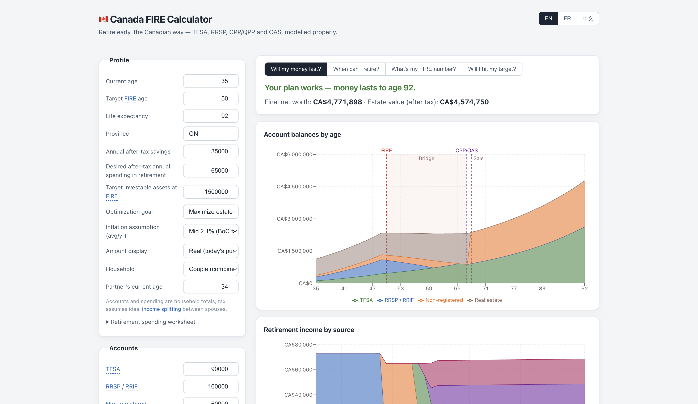
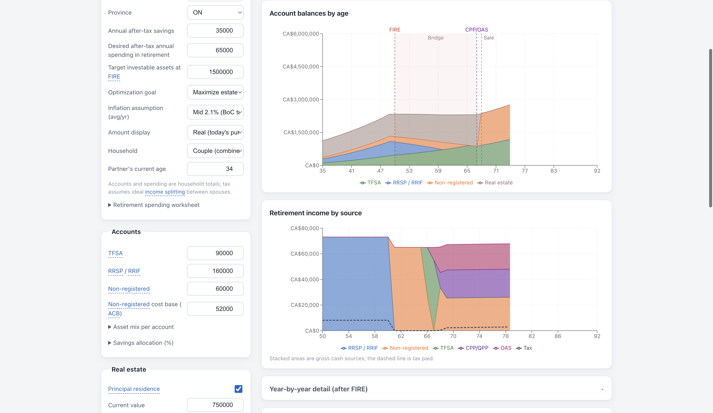
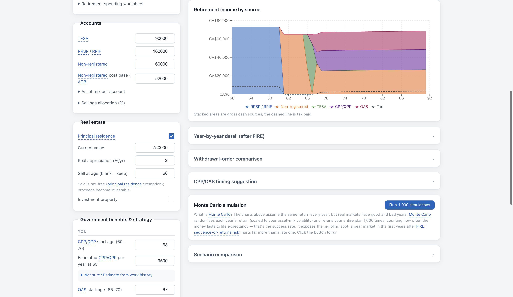
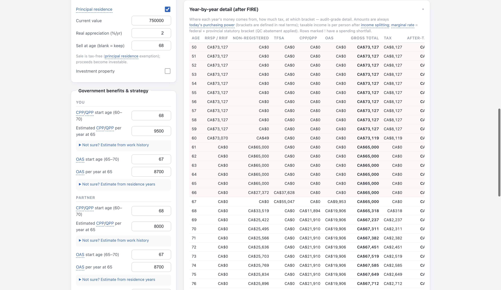
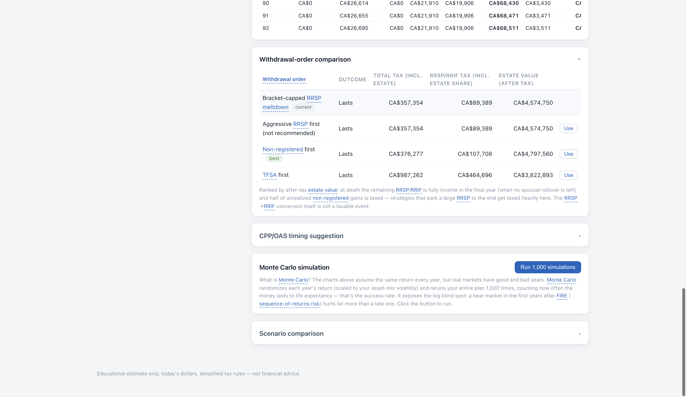
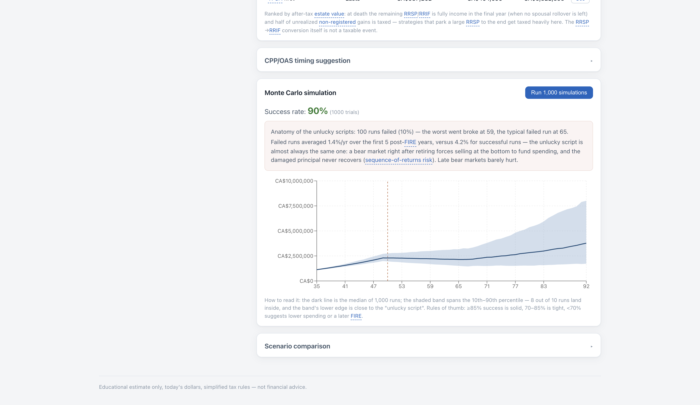
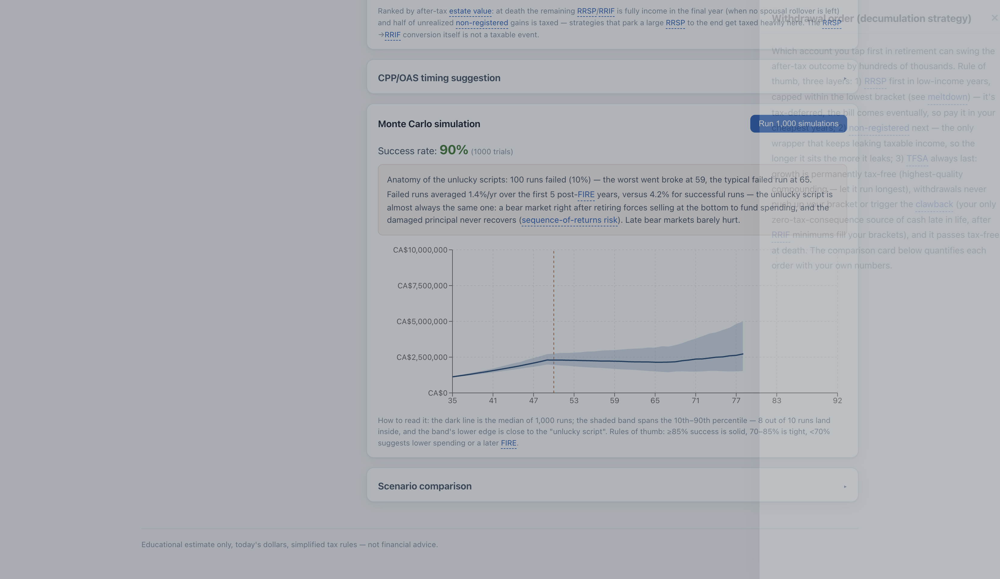

# 🇨🇦 Calculateur FIRE Canada

[English](README.md) · **Français** · [中文](README_CN.md)

Un calculateur FIRE (indépendance financière, retraite anticipée) conçu
**spécifiquement pour les Canadiens**. Les outils génériques de la « règle du 4 % »
ignorent tout ce qui décide réellement d'une retraite anticipée canadienne : le
traitement fiscal des comptes (CELI / REER / non enregistré), le calendrier
RPC/RRQ et SV, les retraits minimums obligatoires du FERR, la récupération de la
SV, l'ordre de décaissement, et le sort du REER au décès. Ce calculateur modélise
tout cela.

**Démo en ligne : <https://leoli-dev.github.io/canada-fire-calculator/>**

**Application 100 % frontale, axée sur la vie privée** : pas de serveur, pas de
compte, pas d'IA — vos chiffres ne quittent jamais le navigateur (persistés en
`localStorage`); seules des statistiques d'utilisation anonymes (pages vues, clics
sur les fonctionnalités — jamais vos données saisies) sont envoyées à Google
Analytics. Anglais / Français / 中文.



## Démarrage rapide

```sh
npm install
npm run dev      # serveur de développement
npm test         # tests unitaires du moteur (vitest)
npm run build    # vérification de types + build de production
```

Le moteur de calcul (`src/engine/`) est un module TypeScript pur, sans dépendance
UI — chaque chiffre affiché provient d'une simulation année par année,
déterministe et testée.

## Ce qui est calculé

**Une simulation en trois phases, année par année**, en dollars réels (ajustés à
l'inflation) :

1. **Accumulation** (aujourd'hui → FIRE) : l'épargne après impôt alimente
   CELI / REER / non enregistré selon votre répartition.
2. **Pont** (FIRE → RPC/SV) : la fenêtre à faible revenu. Les dépenses sont
   financées par les retraits selon votre stratégie; chaque année le moteur résout
   par recherche binaire le retrait brut qui produit net vos dépenses cibles.
3. **Pension** (RPC/SV → espérance de vie) : les prestations arrivent; dès 72 ans
   les minimums FERR sont forcés, besoin ou pas — pour un couple, le minimum est
   calculé sur l'âge du conjoint le plus jeune (choix de l'âge du conjoint),
   appliqué automatiquement car toujours plus avantageux.

**Le moteur fiscal** : vrais paliers marginaux fédéral + provincial (les 13
provinces et territoires, chiffres 2026, mis à jour annuellement), montants
personnels de base (avec la réduction à revenu élevé au fédéral, au Manitoba et au
Yukon), abattement québécois, surtaxe et prime-santé de l'Ontario, prime RAMQ et
cotisation au FSS au Québec, montant en raison de l'âge dès 65 ans et crédit
pour revenu de pension (les rentes d'employeur y donnent droit à tout âge, les
retraits FERR dès 65 ans — y compris le
supplément pour aînés de la Saskatchewan), inclusion de 50 % des gains en capital
suivie par le PBR, frein fiscal annuel sur les distributions non enregistrées,
récupération de la SV par personne (taux 75+ inclus), SRG pour les retraités à
faible revenu imposable (avec l'exemption pour revenu d'emploi et l'Allocation
pour le conjoint de 60 à 64 ans), frais d'homologation au décès et, pour les
couples, fractionnement du revenu sur deux déclarations.

**Stratégies de décaissement**, comparées côte à côte avec vos propres chiffres :

- **Meltdown REER plafonné** (défaut : premier palier) : le REER finance d'abord
  les dépenses, mais seulement selon le besoin et jamais au-delà de la place
  restante dans le plafond choisi après RPC/SV (un plafond par conjoint) — le
  premier palier par défaut, ou le deuxième palier / le seuil de récupération
  de la SV pour les gros REER, afin d'éviter que l'argent reste coincé au
  premier palier et finisse en retraits FERR forcés puis imposé à 100 % au
  décès; le reste passe 71 ans et sort via les minimums FERR. Rien n'est
  retiré juste pour payer l'impôt d'avance.
- REER d'abord (agressif), non enregistré d'abord, CELI d'abord — pour voir
  exactement ce que coûte chaque choix.

**Honnêteté successorale** : au décès, le REER/FERR restant est entièrement imposé
dans la dernière année et la moitié des gains non réalisés est imposée (le CELI et
la résidence principale passent libres d'impôt); les avoirs non enregistrés et
l'immobilier non vendu doivent aussi des frais d'homologation (les 13 barèmes
provinciaux/territoriaux sont intégrés — les comptes avec bénéficiaire désigné y
échappent). Les stratégies sont donc classées par **valeur successorale après
impôt** — ou, sous l'objectif **Die with Zero**, par les dépenses annuelles
soutenables maximales.

**Également modélisés** : une **rente d'employeur à prestations déterminées (PD)**
par conjoint (rente viagère à un âge de début choisi, indexation partielle à
l'IPC, et une prestation de raccordement qui cesse à 65 ans — imposée comme
revenu de pension, fractionnable à tout âge, visible pour la récupération de la
SV et le SRG; les régimes CD et les CRI se saisissent plutôt comme soldes de
comptes), un compte **CELIAPP** combiné du ménage (les cotisations sont
prélevées sur l'épargne annuelle, la croissance suit l'hypothèse REER, et il se
transfère toujours libre d'impôt — soit vers l'achat d'une maison, soit, à
défaut, vers le REER au plus tôt de 15 ans après l'ouverture ou 71 ans), vente
de la résidence principale (libre d'impôt) **ou un achat futur prévu** (mise de
fonds financée dans l'ordre fixe CELIAPP → CELI → non enregistré → REER, le
reste amorti par une hypothèque générée automatiquement),
n'importe quel nombre d'immeubles locatifs — chacun vendable à son propre âge
(gain imposé) ou conservé pour son **revenu locatif net** (imposé comme revenu
ordinaire, visible pour la récupération de la SV et le SRG) — avec en option une
**hypothèque rattachée** à cet immeuble précis (remboursée en priorité sur le
produit de la vente, ses intérêts déductibles du loyer de cet immeuble), **dettes**
(hypothèque / prêt auto / autre : le moteur déduit le taux implicite de chaque
prêt et laisse l'inflation éroder les paiements nominaux fixes — les paiements
s'ajoutent aux dépenses de retraite jusqu'au remboursement, les soldes réduisent
la valeur nette et la succession), **revenu d'appoint Barista-FIRE** sur une
plage d'âges choisie (avec l'exemption officielle du SRG pour revenu de travail),
estimation RPC/RRQ selon l'historique de travail (règle des 39 meilleures années
avec diviseur ajusté à l'âge de demande), SV selon les années de résidence et son
+10 % automatique à 75 ans, tableaux complets des âges de début RPC 60-70 (RRQ
jusqu'à 72) / SV 65-70, frais de placement (RFG), et simulation Monte-Carlo
(1 000 essais dans un web worker, un même tirage de marché annuel pour tous les
comptes) avec anatomie des échecs. Les entrées sont validées à la saisie —
ordres d'âges impossibles, montants négatifs, âges de demande hors fenêtre et
prêts qui ne s'amortissent jamais sont signalés directement dans le formulaire.

## Comment remplir

Descendez la colonne de gauche; chaque terme souligné ouvre une explication en
langage clair (voir le tiroir-glossaire ci-dessous).

- **Profil** — âges, province, épargne annuelle après impôt, dépenses de retraite
  nettes souhaitées (pouvoir d'achat d'aujourd'hui; une feuille de dépenses aide à
  les construire). Choisissez un **objectif** : maximiser la succession, ou
  **Die with Zero**. L'hypothèse d'inflation et l'affichage réel/nominal ne
  changent que l'*affichage* — le calcul reste en dollars réels.
- **Ménage** — le mode couple totalise comptes et dépenses et impose le revenu
  fractionné sur les deux conjoints; chacun a son propre calendrier RPC/SV.
- **Comptes** — soldes actuels par enveloppe. Pour le non enregistré, entrez le
  **PBR** (« book cost » chez le courtier) : seul le gain au-dessus est imposé,
  laisser 0 gonfle énormément l'impôt. Les préréglages de répartition d'actifs
  fixent des rendements réels et volatilités réalistes.
- **CELIAPP** — un seul montant combiné du ménage (le total des deux conjoints,
  pas chacun séparément) : solde actuel, cotisation annuelle (prélevée sur
  l'épargne annuelle avant sa répartition entre CELI/REER/non enregistré), et
  années depuis l'ouverture (les droits de cotisation ne s'accumulent qu'à
  partir de cette année-là, contrairement au CELI). Le compte se ferme au plus
  tôt d'un achat admissible, 15 ans, ou 71 ans.
- **Immobilier** — une carte de résidence principale selon deux modes : **déjà
  propriétaire** (valeur actuelle, appréciation, âge de vente optionnel) ou
  **achat prévu** (âge d'achat, prix et mise de fonds en dollars d'aujourd'hui,
  une hypothèque dérivée automatiquement du versement + des années, et un
  changement net du coût de possession par an) — plus n'importe quel nombre
  d'immeubles locatifs, chacun avec un âge de vente optionnel et un loyer
  annuel net optionnel (loyer moins frais d'exploitation; il cesse l'année de
  la vente). La vente de la résidence principale est libre d'impôt; la mise de
  fonds d'un achat prévu est financée dans l'ordre fixe CELIAPP → CELI → non
  enregistré → REER, non modifiable.
- **Dettes** — hypothèque, prêt auto ou autre, chacune en (solde, paiement
  annuel, années restantes). Saisissez comme épargne annuelle ce que vous
  épargnez réellement *après* les paiements de dettes; le moteur ajoute les
  paiements aux dépenses de retraite jusqu'au remboursement de chaque prêt.
- **Revenu d'appoint** — revenu post-FIRE optionnel (Barista FIRE) avec une
  plage d'âges; ne le soustrayez pas vous-même des dépenses de retraite.
- **Prestations gouvernementales** — âges de début et montants à 65 ans RPC/RRQ
  et SV, par conjoint, avec estimateurs intégrés (historique de travail pour le
  RPC, années de résidence pour la SV).
- **Rente d'employeur** — optionnelle, par conjoint : le montant annuel viager
  indiqué sur votre relevé de retraite (déjà réduit pour un début anticipé),
  l'âge de début, le pourcentage d'indexation à l'IPC, et toute prestation de
  raccordement (versée jusqu'à 65 ans). Un régime CD ou un CRI ? Ajoutez plutôt
  son solde au champ REER/FERR — il se projette de la même façon.

## Comment lire les résultats

**Les quatre onglets-questions** : *Mon argent durera-t-il ?* · *Quand puis-je me
retirer ?* · *Mon chiffre FIRE ?* · *Atteindrai-je ma cible ?* — chaque réponse
est accompagnée de sa méthode.

**Soldes des comptes par âge** — richesse empilée par enveloppe; lignes
pointillées pour FIRE, la première prestation et toute vente immobilière; zone
teintée = années-pont. Regardez le REER bleu fondre pendant le pont tandis que le
CELI vert compose intact.



**Revenus de retraite par source** — d'où vient l'argent chaque année (empilé) et
l'impôt payé (pointillé).



**Composition de l'impôt par source** — juste en dessous, la même ligne pointillée
d'impôt éclatée en graphique empilé : quelle part de l'impôt de l'année vient des
retraits REER, des gains/distributions non enregistrés, du RPC/RRQ, de la SV, du
loyer/gain de vente immobilier, ou du revenu d'appoint (Barista FIRE). C'est une
répartition proportionnelle, pas légale (tout le revenu canadien est imposé ensemble
sur un seul barème), mais les tranches totalisent toujours exactement la ligne
d'impôt ci-dessus. Survoler un point affiche aussi le revenu imposable par personne,
le taux d'imposition moyen et le palier marginal de l'année.

**Détail année par année** (replié par défaut) — le tableau d'audit : retraits par
compte, prestations, brut, impôt, net, revenu imposable par personne et son palier
marginal.



**Comparaison des ordres de décaissement** — les quatre stratégies sur vos
chiffres : impôt total (succession incluse), impôt payé sur l'argent REER/FERR, et
la métrique de classement selon votre objectif. Un clic applique la ligne.



**Calendrier RPC/SV** — tableaux complets pour chaque âge de début (RPC 60-70,
SV 65-70).

**Scénario A/B** — enregistrez vos données actuelles comme scénario A, puis
changez ce que vous voulez et comparez côte à côte le résultat (réussite du plan,
succession après impôt) avec vos chiffres actuels. Un bouton restaure le scénario A
comme données actuelles à tout moment — explorer une hypothèse ne vous fait jamais
perdre votre référence.

**Monte-Carlo** — rendements aléatoires, plan rejoué 1 000 fois. Le panneau
d'anatomie des échecs montre comment les mauvais scénarios échouent réellement
(presque toujours : un marché baissier dans les cinq premières années — risque de
séquence des rendements), et le graphique superpose la trajectoire du pire scénario
— celui qui s'est épuisé le plus tôt — par-dessus les bandes de percentiles.



**Le tiroir-glossaire** — chaque terme souligné (REER, PBR, meltdown,
récupération, taux marginal…) ouvre une explication claire; 39 entrées, trois
langues.



## Hypothèses et limites

- Tous les montants sont en **pouvoir d'achat d'aujourd'hui**; rendements réels.
- Données fiscales 2026, fédéral + toutes les provinces et tous les territoires
  (vérifiées contre l'ARC, les budgets provinciaux et TaxTips), mises à jour
  manuellement.
- Le mode couple suppose un fractionnement idéal 50/50 du RPC, des retraits REER,
  du loyer et des revenus de placement; avant 65 ans, les retraits REER sont
  imposés au seul titulaire — préparez des soldes comparables (REER de conjoint).
  Exception : le revenu d'appoint Barista FIRE est imposé entièrement sur vous,
  car un revenu de type emploi ne peut légalement pas être partagé avec un conjoint.
- Les distributions non enregistrées et le loyer net sont imposés chaque année
  comme revenu ordinaire (simplification volontaire : pas de majoration/crédit de
  dividendes, pas de DPA locative); le SRG suit une approximation linéaire des
  tables officielles; saisissez votre épargne **après impôt et après paiements de
  dettes** — le remboursement REER n'est pas recyclé.
- Les paiements de dettes sont fixes en dollars nominaux (pas de refinancement ni
  de taux variable); le taux d'intérêt est déduit du trio solde / paiement /
  années restantes. Une hypothèque peut aussi être rattachée directement à un
  immeuble précis plutôt qu'à la liste générale de dettes — elle est alors
  remboursée en priorité sur le produit de la vente, et ses intérêts sont
  déductibles du loyer de cet immeuble tant qu'il est détenu.
- La déduction fiscale des cotisations au CELIAPP n'est pas modélisée comme un
  remboursement séparé, cohérent avec « le remboursement REER n'est pas recyclé »
  ci-dessus; le Régime d'accession à la propriété (RAP) n'est pas modélisé non
  plus — le CELIAPP couvre déjà la majeure partie d'une mise de fonds typique, et
  suivre un calendrier de remboursement du RAP sur 15 ans ajoute de la complexité
  pour peu de précision supplémentaire. La mise de fonds d'un achat prévu est
  toujours financée dans l'ordre CELIAPP → CELI → non enregistré → REER — non
  modifiable, même si un autre ordre serait plus avantageux fiscalement pour un
  ménage donné. Le champ de changement net du coût de possession est ce que vous
  y indiquez (p. ex. taxes foncières et entretien moins le loyer épargné) — il
  exclut le versement hypothécaire, traité comme n'importe quelle autre
  hypothèque.
- Les rentes d'employeur sont simplifiées : les pourcentages de rente au
  survivant ne sont pas modélisés (les deux conjoints sont supposés atteindre
  l'espérance de vie commune), la règle québécoise exigeant 65 ans pour le
  fractionnement du revenu de pension est ignorée (le fractionnement reste
  idéalisé à tout âge), une rente partiellement indexée ne s'érode qu'à partir
  de son âge de début (pas d'érosion pendant la période de report), et les
  soldes CD/CRI saisis comme REER ignorent les plafonds de retrait du FRV.
- Pas encore modélisés : crédits de dividendes, plafonds CELI/REER, bonification
  du RPC (cotisations post-2019 — estimations prudentes pour les plus jeunes),
  chocs de soins de longue durée.
- Monte-Carlo tire un choc de marché par année, partagé par tous les comptes
  (corrélation complète). Le taux de réussite est sensible à l'hypothèse de
  rendement — lisez-le comme « probabilité de ne jamais devoir s'ajuster ».

**Estimation éducative seulement — pas un conseil financier.**

## Licence et contributions

Projet personnel, fourni tel quel. Issues et PR bienvenus.
